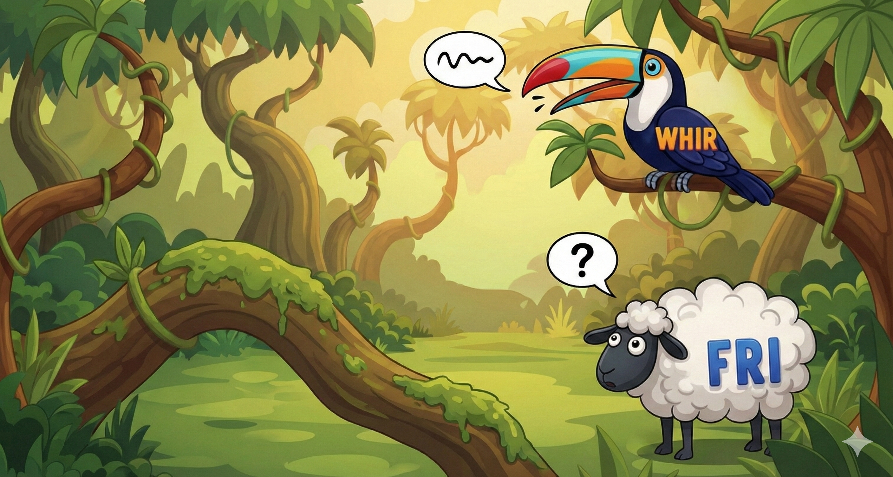

Zero-Knowledge (ZK) proof systems are entering their main character era. These protocols are buzzing through developer conferences and boardrooms, finally getting the attention they deserve.

Let's hack through the vines of this jungle to understand what we are looking at.

## The ZK Vibe Check

A Zero-Knowledge Proof allows a **Prover** to demonstrate the truth of a statement to a **Verifier** without leaking any extra info.

Imagine proving you know the password to a club without screaming it for the whole line to hear. That is the energy here.

In the modern digital landscape, ZK proofs serve two massive purposes:
1.  **Privacy (Zero Knowledge):** Hiding data while verifying compliance (like proving you are 18+ without dropping your birthdate).
2.  **Scalability (Data Compression):** The holy grail for blockchains. A "validity proof" lets a network verify a massive bundle of transactions by checking one tiny cryptographic proof. So, for instance you could be verifying a multi-gigabyte proof by just receiving a proof of a few Kbs.

## A Brief History of Magic

ZK feels futuristic, but the roots go back to the 1980s when **Shafi Goldwasser, Silvio Micali, and Charles Rackoff** dropped a [seminal paper on "knowledge complexity."](https://people.csail.mit.edu/silvio/Selected%20Scientific%20Papers/Proof%20Systems/The_Knowledge_Complexity_Of_Interactive_Proof_Systems.pdf) They gave us the theoretical bedrock for convincing someone of a truth without spilling the tea.

[**Ethereum**](https://ethereum.org/en/zero-knowledge-proofs/) deserves massive kudos for dragging ZK tech into production. The community poured resources into R&D to solve scaling issues and build privacy mixers. They took algorithms previously thought too heavy and optimized them for the real world. In a nutshell they saw the potential and applicability of this tech, and believed in it, before everyone else.

Now, we are seeing the next evolution: **Identity**.
The EU is pushing for robust digital identity frameworks with regulations like **eIDAS**. ZK proofs are the perfect partner here, allowing citizens to verify their identity without doxxing themselves to every random website. This is explicitly mentioned as a suggestion in the [**eIDAS** guidelines](https://github.com/eu-digital-identity-wallet/eudi-doc-architecture-and-reference-framework), btw.

Initiatives like [**Zupass**](https://zupass.org/) (born from the Zuzalu experiment) are also doing this. They use ZK to create portable, private "proof of unique human" credentials.

## Different ZKs, Different Stats

Every ZK system has its own unique trade-offs.

Building a system requires choosing the right flavor. For this post, we are focusing on quantum-resistant options and skipping over traditional Pairing-Based ZK-SNARKs. We want math that stays secure even when quantum computers enter the chat.

Selecting a ZK system involves balancing a "Trilemma" of performance:
1.  **Proving Speed:** Time to generate the proof.
2.  **Verification Speed:** Time to check the proof.
3.  **Proof Size:** The weight of the proof in kilobytes.

Here are two major categories of quantum-resistant ZK proofs.

### 1. STARK-based / Hashing-based Protocols

These rely on collision-resistant hash functions and lots, lots of polynomials.
* **The Stats:** Small proofs and very fast verification. The Prover takes a hit on memory and CPU usage.
* **Key Players:**
    * [**FRI (Fast Reed-Solomon Interactive Oracle Proofs of Proximity):**](https://eccc.weizmann.ac.il/report/2017/050/) The backbone of STARKs. It verifies computations efficiently but demands significant power to generate the proof.
    * [**Whir:**](https://eprint.iacr.org/2024/1586.pdf) A new challenger optimizing the "polynomial degree folding" schemes used in FRI. Whir focuses on super-fast verification times, perfect for resource-constrained verifiers like smart contracts.

### 2. MPC-in-the-Head

These constructions use techniques from [Secure Multi-Party Computation (MPC)](https://web.cs.ucla.edu/~rafail/PUBLIC/77.pdf). The Prover simulates multiple parties computing a function and reveals the internal state of a subset to the Verifier. This is actually smart: Since we're only revealing a subset of the MPC, the proof stays zero-knowledge, and the verifyer doesn't acquire any sensitive info. Yet, verifyer can check that the different, revealed part of the MPC actually match with each other. This would be false with overwhelming probability if prover tried to scam verifyer, giving us soundness.

* **The Stats:** Super fast proving times (often linear in circuit size). The resulting proofs are large (tens of kilobytes to megabytes).
* **Key Players:**
    * [**ZK-Boo**](https://eprint.iacr.org/2016/163) & [**Picnic:**](https://eprint.iacr.org/2017/279) Early practical implementations of MPC-in-the-head. They use symmetric-key primitives, making them very fast to compute.
    * [**Ligero:**](https://eprint.iacr.org/2022/1608) Blends MPC concepts with coding theory. It achieves excellent prover performance with larger proofs.

## Which ZK Slaps for Your Use Case?

Navigating the jungle requires knowing your destination.

**Building Blockchain Infrastructure (L1/L2)?**
Bandwidth and verification cost are the priority. The proof needs to fit into a transaction and cost very little gas.
* *Verdict:* **STARKs / Whir / FRI.** A centralized sequencer can handle the heavy proof generation if the on-chain verification is cheap and the proof size is small.

**Building Client-Side Privacy or Identity tools?**
Proving something on a mobile phone means limited CPU power but decent bandwidth.
* *Verdict:* **MPC-in-the-head.** For low-complexity statements, the fast proving time of ZK-Boo or Picnic preserves battery life.

**Big ass Server working for A LOT of clients?**
A big server can tackle heavy computation, but if you receive tens of thousands of requests per minute that's still too much.
* *Verdict:* **MPC-in-the-head** as above. Here bandwidth is probs not a problem, and any modern device can handle the verification time.

### What if I need both?

So say you need fast proving time, but also small proofs and fast verification times. If you need all this at the same time, ATM you're fucked. But if you need this at different places in your stack, then there's hope.

For instance, you may need to compute a proof in a super constrained environment, for which you need MPC-based solutions. But you may need to verify this proof in a similarly constrained environment. If you have access to an environmnent with plenty of resources in the middle, then you can *wrap* a ZK proof into another: You take your MPC-based proof, and wrap it into a STARK-based proof in your "nice" environmnent. The resulting proof:

- Is as secure as the original one, as it needs the original, heavy-to-verify proof to be produced.
- It is lightweight to verify.

This is, BTW, the approach we're playing with at [NeverLocal](https://neverlocal.com) when it comes to Blockchain Defense (won't spill any tea about this for now here, soz).

All in all, the ZK landscape evolves weekly. We really hope that by understanding these fundamental trade-offs you'll survive the jungle.
