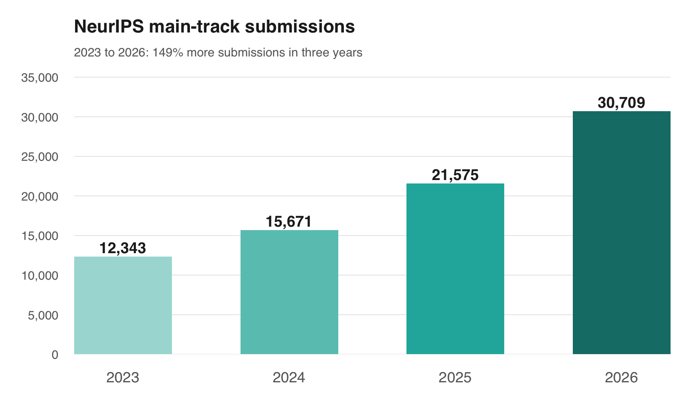

On 1 October 2026, arXiv [announced and introduced a limit of two submissions per submitter per calendar month](https://blog.arxiv.org/2026/10/01/updated-rate-limit-policy/), across all subject categories, while retaining its cap of three active submissions at any given time.

The reason is volume. arXiv received 40,363 submissions in September 2026, up from 20,569 in September 2024. [Thomas Dietterich, chair of arXiv's Editorial Advisory Council, announced the restriction on X](https://x.com/tdietterich/status/2105751408855450078), pointing to the rapid increase in submissions. The official announcement describes the rule as a stopgap to protect volunteer moderators while arXiv improves its tools and procedures.

ArXiv, for those who do not know, is an open repository for academic preprints. Scientists share their work there before journal publication. Its moderation is not journal peer review. But even this lighter process is running into capacity constraints.

Now, the interesting part is what happens when producing and submitting work becomes much cheaper. The rules for getting through the system, getting reviewed, and getting seen become a lot more consequential. And people, as well as their agents, will adapt to those rules.

# Flooding venues

This is not a single event. Journals are similarly struggling. Data on this is still not systemtized. Yet, single cases tell the signs on the all. 

The editors of *Accountability in Research* [report](https://doi.org/10.1080/08989621.2026.2737718) that they expect more than 1,000 original submissions in 2026, compared with 160 in 2022. They describe the strain of assessing AI-written papers and have capped submissions at four per author per year.

So are academic conferences. Consider NeurIPS, one of the major machine learning conferences. Its main track went from 12,343 submissions in 2023 to 21,575 in 2025, an increase of roughly 75% in two years.[^neurips] Its program chairs describe the difficulty of finding enough qualified reviewers and keeping decisions reliable at that scale. The numbers alone do not tell us how much of the growth came from AI. They do show the workload the system has to absorb.

*NeurIPS main-track paper submissions, as reported by the organizers. The 2025 figure counts valid submissions. Other conference tracks are excluded. Sources and figures: [2023 fact sheet](https://media.neurips.cc/Conferences/NeurIPS2023/NeurIPS2023-Fact_Sheet.pdf), [2024 fact sheet](https://media.neurips.cc/Conferences/NeurIPS2024/NeurIPS2024-Fact_Sheet.pdf), and [2025 program chairs' report](https://blog.neurips.cc/2025/09/30/reflections-on-the-2025-review-process-from-the-program-committee-chairs/).*

And keep in mind, AI can also change how the research itself gets done. See math. But also see science. Bruno and I recently discussed this with Markus Buehler on Taste-Bench. His work on agents spans the research process, including protein design with experimental validation.[^markus] If these systems allow researchers to produce more substantive work, that work will still need to be assessed. Even a world with no slop would have an allocation problem.

This is just the beginning. Academic communities are up for a ride.

# Scale is mandatory

There are two instinctive reactions to this.

1. Try to ban AI.

2. Develop new mechanisms that can make the system work at scale.

These can be combined, and restrictions can buy time. But if the strategy ends with "keep AI out", good luck and so long!

Let's focus on 2 and check out two comments on X regarding arXiv's announcement.

[@TenszNeumann asks](https://x.com/TenszNeumann/status/2105772632008499399) whether the limit applies only to the submitter or also to collaborators. They point out that delays can cause several collaborative papers to become ready for submission in the same month, even for someone who would not usually submit that often.

[@JoaqunMoragaSae objects](https://x.com/JoaqunMoragaSae/status/2105765214646141215) that people posting AI slop can get a co-author to submit it for them. arXiv's own FAQ confirms that submitting a paper uses only the submitter's allowance, not the co-authors' allowances. So there is a coordination problem for legitimate authors, and a way around the limit for people willing to organize around it.

Mhm, this might not be so simple after all.

I am actually not concerned here with improving the arXiv proposal. I do not think a cap on papers can be the long-term answer. [Scott Kominers makes the distinction](https://x.com/skominers/status/2105792318385050095): moderator workload, reader overload, and assumptions about productivity are different problems. Better filtering can help readers. For moderation, he proposes earned trust: lighter scrutiny for authors with strong submission histories, backed by spot audits, revocable privileges, and a clear path for newcomers to earn the same trust.[^kominers]

I am way more concerned with what comes next. Because designing a system in which you can slow down submissions by having restrictions on the human in the loop is one thing. Designing a system in which humans no longer set the pace of production is a very different beast. Human attention is still scarce. It just no longer does the throttling for us.

It is not without irony that we, as a company, were working a related problem in a very different domain six years ago.

# Once upon a time in crypto

In 2020 and 2021 one topic kept coming up around Ethereum, besides Bitcoin the best known blockchain: MEV. Back then, miner extractable value. Today, the broader term is maximal extractable value.[^mev]

This discussion focused on some gnarly internal problem within the blockchain. This went so far that other blockchains were quite desperately hiring us to "get MEV going".

Let me explain what it is, and please bear with me.

To get anything done on a blockchain, say Alice needs to send her USD stablecoin to Bob, this transaction needs to be recorded. What sounds simple in fact rests on a very delicate process that by now involves a whole value chain of actors. The system needs to check that a transaction follows the protocol's rules, given the state in which it executes. Does Alice have the funds? Is the signature valid? And it needs to decide how this specific transaction should be threaded into the timeline of the blockchain. That second part gets complicated.

Now, keep in mind that at every point in time, Alice and Bob are not the only ones trying to transact. So are Charlie and David. And, even more crucially, Ethereum not only allows such simple transactions but allows more complex programs to run - smart contracts (and so do other chains like Solana).

So, there is a whole smorgasbord of individual transactions that are in competition to get recorded. In blockchain lingo: These transactions need to get sequenced into a block that then becomes part of the history on which other new transactions can build.

Now, here is the kicker. With transactions and smart programs running and getting sequenced, the order becomes relevant. Actually, massively important.

Consider the following example. Alice wants to exchange some USDC for ETH (the native Ethereum token). At that time, a natural choice was an Automated Market Maker (AMM). I spare you the details but this thing is a program that waits on input (the token to be switched and information about what should come out, here ETH). USDC goes in, ETH comes out. Like in normal marketplaces, demand and supply affect the exchange rate. So, all else equal, the next person who also wants to buy ETH with USDC in the same pool will get a worse exchange rate. And the larger the trade relative to the pool, the stronger the price movement.

Now, suppose Bob wants the same thing, the same transaction as Alice (he talked to Alice before and like her wants to be on Ethereum - it was 2020 after all). If he comes second, he will receive a worse price, less ETH for the same amount of USDC.

If the order were reversed, so Bob moving before Alice, Bob would have saved money. Now, the natural step for Bob is to ask, wait a second, if I could pay a little to be before Alice, this would make me better off.

And this is the crux of the problem. In a chain that is constructed like Ethereum, the internal workings have to decide which transaction comes first. And the order has externalities. Also note that order mixes with temporal preferences. Charlie might have a legit concern about getting his token to David in time. So, he might be willing to pay for being before other stuff gets executed.

Now, one last ingredient. Ethereum is permissionless: in principle everyone can submit transactions as well as smart contracts. And at the time, many pending transactions were broadcast through a public mempool, a kind of waiting room. These are separate design choices. What matters here is that other actors could see a transaction before it was recorded.

The result was a sprawling ecosystem where financial actors could profit by positioning their own transactions in the right place. Some, called searchers, looked for these opportunities and competed to get their transactions included. Others controlled the ordering: at the time, miners. Those controlling the order could also exploit opportunities themselves. And having an advantage in one part of this process could help you in another.

Two strategies were frontrunning, getting ahead of a target transaction, and sandwiching. In the latter, the attacker buys before Alice, lets her purchase push the price up further, and sells after her. Alice's transaction is the one in the middle. She gets a worse price.

It goes without saying that these systems ran algorithmically. Like in other financial markets, no single human could manually keep up.

I spare you the full sad story of how this market infrastructure developed then. We have [written about parts of it before](). Attempts to manage extraction created new intermediaries, with their own incentives and opportunities to accumulate power. Ethereum is a cautionary tale here. The rules for processing transactions helped shape an entire market, including ways of making money at other users' expense. And each intervention changed what it paid to do next.

# Back to arXiv

The parallel should be clearer now, but let me spell it out. The more production and submission are driven by AI, the more critical the details of the system become. Scientific work does not need one shared transaction history. But someone still has to decide what gets processed, what gets reviewed, and what gets put in front of readers. These are different decisions, all allocating scarce capacity.

I think it is worthwhile to think through this process and how robust it will be if much of the activity comes from agents. Who gets through? Who waits? And what does it pay to do to get ahead?

First, there are basic checks. Is the submission complete? Does it belong in the category? Does it meet the repository's requirements? Automation can help here. But passing these checks does not establish that a scientific claim is true. On a blockchain, validity is defined by the protocol's rules. In science, a claim can remain unsettled for years.

And even if a result is correct, there is another question: is it actually relevant? Does it deserve attention? This is much more central to the selection done by journals and conferences than to arXiv's moderation. It involves judgment, including the possibility that different people will make different selections.[^iulia] So, there are questions of admission, scientific validity, and merit. Improving one part does not settle the others.

Now, consider a lab running a whole set of agents. Suppose they learn what passes a venue's screening and produce many narrowly different papers that each meet those requirements. Each paper takes some time to assess. Each also competes to be seen. The lab can occupy more of both the review queue and the reader's attention, leaving less for others. No fabricated result is needed for this to become a problem. The rules can reward being good at getting through the system, even when the additional scientific contribution is small.

This is the connection to frontrunning: actors adapt to the allocation rules and gain an advantage at someone else's expense. It need not involve copying another scientist's result or getting a paper out a day earlier. And the rules will also affect people who just want to submit good work, like Charlie who just wanted to get his token to David in time.

The quota discussion already shows why identity matters. An allowance per submitter makes the way a group organizes its submissions relevant. Genuine co-authors coordinating is one thing. One actor creating many identities to multiply an allowance is another: the familiar Sybil problem.[^sybil] arXiv already has [endorsement requirements](https://info.arxiv.org/help/endorsement.html), so access is not unrestricted. But having some restrictions does not make the allocation problem disappear.

Earned trust, as Kominers proposes, makes reputation relevant as well. How is it earned? How can it be abused? When is it revoked? And how does a newcomer get a fair chance? Relying on established reputations can save review time, but it can also make entry harder. Keeping participation open makes it harder to contain abuse. These are design tradeoffs familiar from distributed systems like blockchains. They will matter here as well.

And yes, security matters for conferences and journals too. Flooding a review pipeline, creating fake reviewer identities, or coordinating favorable reviews are ways to interfere with its functioning. More votes do not help much if the voters are controlled by the same actor or are doing favors for one another. Agreement is not a guarantee of independence, let alone truth.

This is also where credible neutrality matters.[^neutrality] Participants need reason to believe that the shared rules are applied consistently and cannot simply be bent for whoever controls the process. Different levels of scrutiny can be justified, but the basis for them has to be defensible. That leaves plenty of room for different journals, curators, and communities to have different tastes. A neutral process does not require everyone to value the same work, or every paper to receive equal attention.

Whatever the exact shape of conferences and journals will be in the future, and I am sure they will look very different than today, their value will depend on how well they assess claims and help us find work worth spending time on. The design of the process affects whether they can do either.

# The ultimate resource

Academia is the canary in the coal mine. But the same problem reaches much further. Look at timelines on social media. X is swamped, LinkedIn is flooded with garbage.

Think of the manuscript arriving at a publishing house, the email in your inbox, or the memo you have to read. Employees can create a lot more output that might be more of a "slop grenade" than actual content.[^slop] Writing it becomes cheaper. Assessing it still takes someone else's time. And even when the content is good, there is only so much time to go around.

Human attention does not expand at the same pace as production. Herbert Simon made this point in 1971: "a wealth of information creates a poverty of attention".[^simon] The scarce resource is our attention budget. More output competes for it, and the person producing the output does not necessarily bear the cost of consuming it.

AI can help on this side as well. It can filter, check, and summarize. But then we are back to the same questions. What does the filter select for? Who controls it? And how will people adapt once they learn what gets through? Delegating some of the work can help us use our attention better. Deciding what deserves that attention still involves judgment.[^hector]

And for god's sake, no, I do not want to put things onchain.

What I do think is that experiences from designing decentralized systems will be relevant here.[^joshua] Identity, reputation, incentives, collusion, and the tendency for power to accumulate around whoever runs the process. Crypto has given us plenty of experience with what can go wrong when these interact. As more knowledge work is produced and processed by agents, those experiences will matter well beyond crypto. We should use them while we can still shape the rules.

# Notes

[^neurips]: The NeurIPS fact sheets report [12,343 main-track submissions in 2023](https://media.neurips.cc/Conferences/NeurIPS2023/NeurIPS2023-Fact_Sheet.pdf) and [15,671 in 2024](https://media.neurips.cc/Conferences/NeurIPS2024/NeurIPS2024-Fact_Sheet.pdf). The [2025 program chairs' report](https://blog.neurips.cc/2025/09/30/reflections-on-the-2025-review-process-from-the-program-committee-chairs/) gives 21,575 valid main-track submissions and discusses the resulting pressure on reviewer recruitment and decision-making. These are the three figures plotted above.

[^markus]: Markus Buehler joins us in [*Creativity Across Disciplines, From Materials Science to Bach*](https://podcasts.apple.com/us/podcast/creativity-across-disciplines-from-materials-science/id6783881326?i=1000792427587), Taste-Bench episode 17 (30 September 2026). We discuss agent systems working across the research process. Among the work referenced in the episode is Fiona Y. Wang, Di Sheng Lee, David L. Kaplan, and Markus J. Buehler's [*Swarms of Large Language Model Agents for Protein Sequence Design with Experimental Validation*](https://arxiv.org/abs/2511.22311).

[^kominers]: The linked thread introduces implications of Kominers's *Moderation under Inundation: A Market Design Framework*. He says the paper is not yet ready to circulate. He also discloses having been rate-limited himself; his argument is about policy design, not a personal exemption. His objective is to allocate review where its expected benefit justifies its cost. He also raises the risk that restricting valuable, prolific contributors gives them a reason to seek other platforms.

[^mev]: See the Ethereum documentation on [maximal extractable value](https://ethereum.org/developers/docs/mev/) for the terminology and examples. Phil Daian and co-authors' [*Flash Boys 2.0*](https://arxiv.org/abs/1904.05234) documented automated competition for transaction ordering and its consequences for Ethereum in 2019.

[^iulia]: Bruno Marnette and I discuss editorial judgment with Iulia Georgescu, who spent over a decade at the Nature journals and founded *Nature Reviews Physics*, in [*Taste is how we spot breakthroughs*](https://www.youtube.com/watch?v=Cwsvqplv_tY), Taste-Bench episode 15 (16 September 2026). Her account of selecting papers illustrates why deciding what deserves attention involves judgment under uncertainty. See also the [episode transcript](https://www.taste-bench.com/podcast/transcripts/15-iulia-georgescu).

[^sybil]: John R. Douceur's [*The Sybil Attack*](https://www.microsoft.com/en-us/research/publication/the-sybil-attack/) (2002) examines what happens when one actor can present multiple identities in a distributed system.

[^neutrality]: See Vitalik Buterin's [*Credible Neutrality As A Guiding Principle*](https://nakamoto.ghost.io/credible-neutrality/) (2020), on mechanisms that participants can reasonably trust not to favor particular people or groups.

[^slop]: Tobi Lütke uses the phrase for unchecked AI work passed on to colleagues in [this clip shared by Shane Parrish](https://x.com/shaneparrish/status/2099852161576223202) (15 September 2026). In a [follow-up post](https://x.com/tobi/status/2099862302467969232), Lütke credits Harry Brundage, who in turn [points to noslopgrenade.com](https://x.com/harrybrundage/status/2099916981671490003).

[^simon]: Herbert A. Simon, [*Designing Organizations for an Information-Rich World*](https://gwern.net/doc/design/1971-simon.pdf), in Martin Greenberger (ed.), *Computers, Communication, and the Public Interest* (1971), pp. 40–41. Simon connects the abundance of information to the need to allocate the attention of its recipients.

[^hector]: In [*Defending our cognitive sovereignty*](https://www.youtube.com/watch?v=xICLSU74iJc), we discuss with Héctor Pérez Urbina the distinction between useful cognitive offloading and surrendering our own judgment. See the [Taste-Bench episode transcript](https://www.taste-bench.com/podcast/transcripts/7-hector-perez-urbina).

[^joshua]: In [*AI sovereignty is not enough*](https://www.youtube.com/watch?v=uMcknBNTz2s), we discuss with Joshua Tan what experiences from crypto governance may transfer to AI, including the concentration of power around the systems we rely on. See the [Taste-Bench episode transcript](https://www.taste-bench.com/podcast/transcripts/2-joshua-tan).
